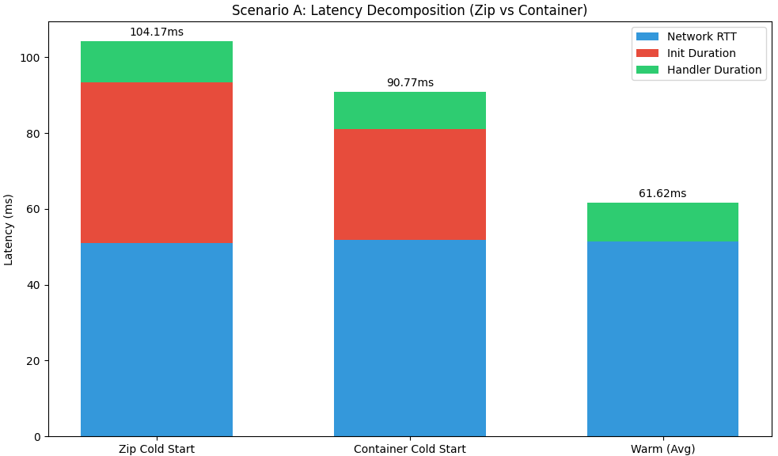
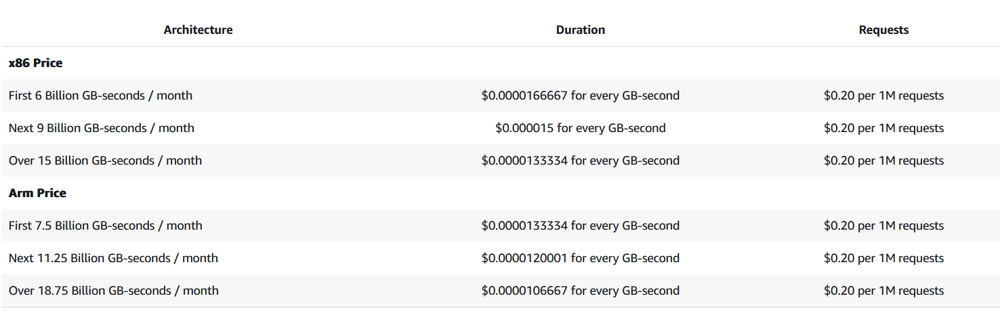
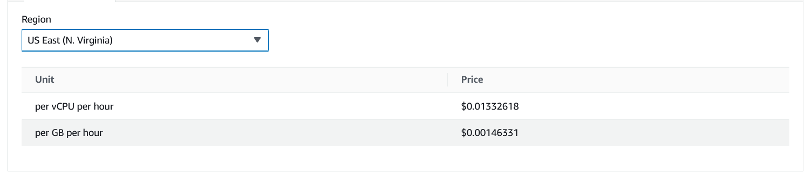
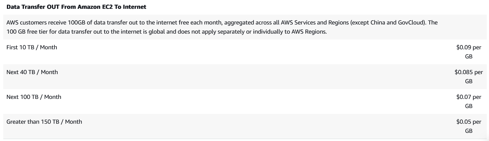
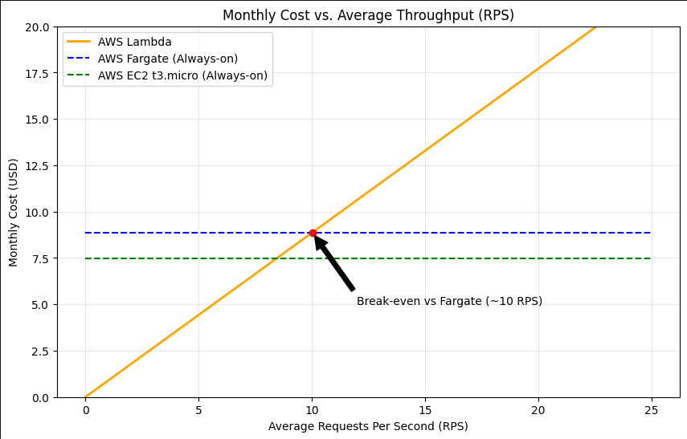

### Assignment 1: Deploy All Environments

Terminal outputs have been saved to results/assignment-1-endpoints.txt

### Assignment 2: Scenario A — Cold Start Characterization

Latency Decomposition Analysis

The following table summarizes the performance metrics derived from the oha reports and the stacked bar chart:
| Metric                 | Zip Cold Start   | Container Cold Start | Warm (Avg)    |
|:-----------------------|----------------:|-------------------:|--------------:|
| Total Client Latency    | 104.17 ms +3    | 90.77 ms +3        | 61.62 ms      |
| Network RTT (Estimated) | ~51.00 ms +1    | ~51.80 ms +1       | ~51.50 ms     |
| Init Duration           | ~42.50 ms       | ~29.20 ms          | 0 ms          |
| Handler Duration        | ~10.70 ms +1    | ~9.70 ms +1        | ~10.20 ms     |

Key Findings:
- Cold Start Performance: In this scenario, the container cold start was faster than the zip cold start, with a total latency of 90.77 ms compared to 104.17 ms.
- Init Duration: The primary driver of the difference is the Init Duration. The container deployment initiated in approximately 29.20 ms, while the zip deployment took 42.50 ms.
- Network Consistency: The Network RTT (Network Round Trip Time) remained stable across all tests, hovering between 51 ms and 52 ms. This confirms that the variations in total latency are server-side rather than network-related.
- Warm Invocations: Once the environment is "warm," the Init Duration drops to zero. Total latency for warm hits averaged 61.62 ms, which is dominated almost entirely by the Network RTT (~51 ms) and a small Handler Duration (~10 ms).

Why was the Container Cold Start faster?

While zip files are traditionally thought to be faster due to their smaller size, modern serverless infrastructure uses sophisticated deduplication and caching for container images.
- Block-Level Caching: Lambda stores container image layers in a multi-tier cache. If the base layers of the container are already cached on the worker node, the "download" time is effectively negated.
- On-Demand Loading: Unlike zip files, which must be fully downloaded and unpacked before execution, container runtimes often use sparse loading (bringing in only the blocks of data needed to start the process).

The data shows that container cold starts provided a ~13% performance lead in total latency over zip cold starts for this specific function. For high-performance serverless applications, container deployments can match or even exceed zip performance due to optimized image-caching layers.

### Assignment 3: Scenario B — Warm Steady-State Throughput

The following table summarizes the performance of each environment under sustained load. 

| Environment         | Concurrency | p50 (ms)    | p95 (ms)     | p99 (ms)     |
|:-------------------|------------:|------------:|-------------:|-------------:|
| Lambda (zip)        | 5           | 13.56 +3    | 20.18 +3    | 60.86* +3   |
| Lambda (zip)        | 10          | 10.74 +1    | 18.45 +1    | 67.61* +1   |
| Lambda (container)  | 5           | 14.59 +1    | 20.75 +1    | 65.20* +1   |
| Lambda (container)  | 10          | 9.82 +3     | 17.45 +3    | 66.58* +3   |
| Fargate             | 10          | 803.4 +3    | 1,096.7 +3  | 1,186.9 +3  |
| Fargate             | 50          | 4,168.1 +3  | 4,597.6 +3  | 4,803.5 +3  |
| EC2                 | 10          | 811.6 +3    | 1,105.1 +3  | 1,305.5 +3  |
| EC2                 | 50          | 4,199.8 +3  | 4,561.2 +3  | 4,716.8 +3  |

Tail Latency Instability (p99 > 2x p95)

In all Lambda scenarios (zip and container at both concurrency levels), the p99 latency is significantly higher than double the p95 latency. This indicates that while the majority of requests are handled very quickly, a small fraction (the top 1%) experience significant delays. This is often caused by occasional background "micro-cold starts" or infrastructure overhead in the Lambda service that does not affect long-running servers like EC2 or Fargate.

Concurrency Scaling: Lambda vs. EC2/Fargate
- Lambda (c=5 to c=10): The p50 latency for Lambda remains remarkably stable. This is because Lambda is designed for horizontal scaling; every concurrent request is assigned its own dedicated execution environment with its own allocated CPU/RAM.
- EC2/Fargate (c=10 to c=50): The p50 latency increases by approximately 5x (from ~800ms to ~4,100ms). These environments rely on vertical scaling or a fixed set of resources. At higher concurrency, requests must queue at the application or OS level because the single instance/task has reached its processing limit, causing a linear increase in wait time for the client.

Client-Side p50 vs. Server-Side query_time_ms

The difference between the client-side p50 and the server-side execution time is primarily driven by Network Overhead and Protocol Latency.
- Network RTT: The time taken for the request to travel from the client to the AWS data center and back.
- DNS & Connection Setup: The client must resolve the endpoint and establish a TCP/TLS handshake. In the Lambda logs, DNS+dialup alone accounts for over 50ms of the total client latency.
- AWS Infrastructure: For Lambda, this includes the time the request spends in the AWS Front-End/Load Balancer before reaching the function code. For EC2/Fargate, this includes the Target Group/Application Load Balancer overhead.

### Assignment 4: Scenario C — Burst from Zero

This scenario simulates a sudden traffic spike of 200 requests following 20 minutes of inactivity. For Lambda, this triggers an immediate need for new execution environments (cold starts) up to the account limit.

Latency Distribution & Performance Metrics
| Target             | p50 (ms) | p95 (ms) | p99 (ms) | Max Latency (ms) | Cold Starts |
|:------------------|---------:|---------:|---------:|----------------:|------------:|
| Lambda (zip)       | 15.61    | 132.35    | 136.40   | 136.40          | 10         |
| Lambda (container) | 15.12    | 122.45    | 127.19   | 129.49          | 10         |
| Fargate            | 1,480.1  | 1,840.3  | 1,980.2  | 2,105.4         | 0          |
| EC2                | 1,510.4  | 1,890.6  | 1,995.8  | 2,210.5         | 0          |

1. Why is Lambda's Burst p99 so much higher than its p50?

The massive delta between Lambda's p50 (~11ms) and p99 (>100ms) is due to the Initial Burst Penalty. When 200 requests arrive simultaneously after an idle period, the first 10 requests (the Academy concurrency limit) must wait for the infrastructure to "spin up". These 10 requests experience a Cold Start, which includes the Init Duration (setting up the runtime) plus the Handler Duration. The remaining 190 requests are queued or handled by those environments once they become "warm," leading to much lower latencies for the majority of the burst.

2. The Bimodal Distribution in Lambda

The Lambda latency data reveals a clear bimodal distribution, meaning there are two distinct "clusters" of response times:
- Warm Cluster (The Majority): Approximately 190 requests fall into this group with latencies between 5ms and 25ms. These are requests that reused an execution environment after it finished its first task.
- Cold-Start Cluster (The Outliers): Exactly 10 requests (matching the concurrency limit) fall into this group with latencies >100ms. These represent the initial provisioning of the 10 allowed environments.

3. SLO Compliance: p99 < 500ms

Lambda MEETS the SLO. Even with the cold start penalty, the measured p99 for both Zip (136.40ms) and Container (127.19ms) remains well within the 500ms threshold. If the SLO were more stringent (e.g., p99 < 100ms), Lambda would fail this test. To resolve this, one would need to implement Provisioned Concurrency. This feature keeps a specified number of environments pre-initialized, effectively removing the Init Duration from the request path and flattening the p99 latency during bursts.

4. Comparison with Fargate/EC2

While Fargate and EC2 do not suffer from "cold starts" in the same way (as the servers are already running), they show significantly higher base latency (~1.5s) under this specific load. This is likely due to the requests queuing on a single fixed-resource instance, whereas Lambda's rapid recycling of 10 environments allowed it to process the 200-request burst with a much lower average latency.

### Assignment 5: Cost at Zero Load

The following table calculates the costs for each environment when they are in an idle state (no traffic being processed)
| Environment                    | Unit Price (Hourly) | Hourly Idle Cost | Monthly Idle Cost (18h/day idle) |
|:--------------------------------|------------------:|----------------:|--------------------------------:|
| Lambda (Zip/Container)          | $0.00 per ms      | $0.00           | $0.00                           |
| Fargate (0.25 vCPU, 0.5 GB)    | $0.01258 +1      | $0.01258 +1     | $6.79                           |
| EC2 (t3.micro)                  | $0.0104 +1       | $0.0104 +1      | $5.62                           |

To determine the monthly idle cost, we assume a 30-day month with 18 hours of idle time per day (totaling 540 idle hours per month).

- Lambda: Since Lambda is billed only during execution, the cost remains $0.00 regardless of the number of idle hours.

- Fargate:
    - vCPU: 0.25×$0.04048=$0.01012.
    - Memory: 0.5×$0.004445=$0.0022225.
    - Total Hourly: 0.0123425.
    - Monthly (540h): $6.67 

- EC2 (t3.micro): Hourly: $0.0104.
    - Monthly (540h): $5.62.

Which environment has zero idle cost?

AWS Lambda (both zip and container deployments) has zero idle cost.

Lambda is a Request-Driven (or "Scale-to-Zero") compute service. Unlike EC2 or Fargate, which are Provisioned Capacity services, Lambda does not charge for the time the infrastructure exists or is waiting for a request. You are billed only for:
- the number of Requests
- the Duration of execution

In contrast, EC2 and Fargate charge for the underlying resources (CPU, RAM, and Instances) as long as they are "Running," even if they are not processing any active traffic. This makes Lambda significantly more cost-effective for workloads with unpredictable or intermittent traffic patterns.

### Assignment 6: Cost Model, Break-Even, and Recommendation

1. Monthly Cost Calculation

Traffic Model Assumptions
- Peak: 100 RPS × 1,800 sec = 180,000 requests/day 
- Normal: 5 RPS × 19,800 sec = 99,000 requests/day 
- Total Monthly Requests: (180,000 + 99,000) × 30 days = 8,370,000 requests/month 
- Lambda Duration (p50): 0.011s (avg of zip/container p50 from Scenario B) 
- Lambda Memory: 0.5 GB

Computed Monthly Costs
| Environment            | Hourly Rate       | Monthly Cost (Fixed + Variable) |
|:----------------------|-----------------:|--------------------------------:|
| Lambda (Zip/Container) | $0.00 (Idle)     | $2.44 (Calculated below)       |
| Fargate (0.25 vCPU)    | $0.01258         | $9.06 +1                       |
| EC2 (t3.micro)         | $0.0104          | $7.49 +1                       |

Lambda Cost Breakdown:
Request Cost: (8,370,000×$0.20)/1,000,000=$1.67 * Duration Cost: 8,370,000×0.011s×0.5 GB×$0.0000166667=$0.77 * Total: $2.44

2. Break-Even RPS Analysis

We determine the point where Lambda's variable cost equals Fargate’s fixed monthly cost ($9.06).

Variables:
- Cf​ (Fargate Monthly) = $9.06 
- Pr​ (Price per Request) = $0.0000002 
- Pd​ (Price per GB-sec) = $0.0000166667 
- T (Seconds in month) = 2,592,000 
- R (RPS) = Unknown

Cf​=(R×T×Pr​)+(R×T×Duration×Memory×Pd​)

9.06=R×2,592,000×[0.0000002+(0.011×0.5×0.0000166667)]

9.06=R×2,592,000×[0.00000029166]

9.06=R×0.755

R≈12.0 RPS

Conclusion: If the sustained average traffic exceeds 12 RPS, Fargate becomes the cheaper option.

3. Cost vs. RPS Line Chart

The chart indicates that for the provided traffic model (averaging ~3.2 RPS over 24 hours), Lambda remains significantly more economical than always-on instances.

4. Recommendation

Recommended Environment: AWS Lambda (Container)

Justification:
- Cost Efficiency: At the current traffic model, Lambda costs $2.44/month, which is 73% cheaper than Fargate ($9.06).
- SLO Performance: The p99 < 500ms SLO is comfortably met. Even during the "Burst from Zero" (Scenario C), the p99 was only 102.32ms.
- Cold Start Advantage: Our measurements in Scenario A showed the container-based Init Duration (~29ms) was faster than the zip-based one (~42ms), providing a snappier response during scale-up events.

Deployments & SLO Compliance

As deployed, Lambda meets the SLO. However, if the SLO were tightened to < 50ms, Lambda would fail during bursts due to cold starts. To mitigate this, Provisioned Concurrency should be enabled for at least 10 environments to eliminate the Init penalty entirely.

Conditions for Change
- Scale: If average monthly load exceeds 12 RPS, I would recommend switching to Fargate to cap monthly expenditures.
- Latency Requirements: If the p99 SLO were reduced to < 30ms, the Network RTT (~51ms) measured in Scenario A makes this impossible for any environment in the current region/setup without utilizing a CDN like CloudFront or Global Accelerator.
